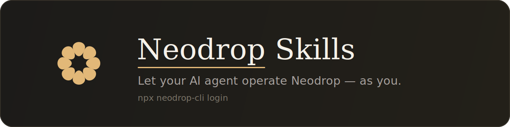
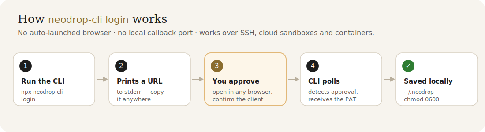

<div align="center">



<p><strong>Let your AI agent operate <a href="https://neodrop.ai">Neodrop</a> as you</strong> — browse channels, read posts, manage subscriptions and create channels, without leaving your editor.</p>

[](https://www.npmjs.com/package/neodrop-cli)
[](https://nodejs.org)
[](https://www.npmjs.com/package/neodrop-cli)
[](./LICENSE)
[](https://github.com/NeoDropAI/neodrop-skills/pulls)

**English** · [简体中文](./README.zh-CN.md)

</div>

---

This repository hosts every official **Neodrop AI skill**. Today there is one — [`neodrop-cli`](./skills/neodrop-cli/) — with more to come.

## ✨ What your AI can do once this is installed

Every action runs **as you** (authenticated with a Personal Access Token) — exactly equivalent to operating Neodrop yourself in the browser.

| You say… | Your agent does |
|---|---|
| *"What channels am I subscribed to?"* | Calls the CLI and answers from real data |
| *"Build me a channel tracking the AI industry"* | Assembles the input and runs `channels create` |
| *"Any channels about quant trading on Neodrop?"* | Combines `channels search` + `channels by-category` |
| *"Subscribe to this channel / unsubscribe from X"* | Calls `channels subscribe` / `unsubscribe` directly |
| *"Here's a Neodrop link — what's in it?"* | Maps the URL to the right `get` command |

## 🚀 Quick start

### 1 · Prerequisites

| Requirement | Notes |
|---|---|
| **Node 18+** | Check with `node --version`; ships with `npx`. Install the LTS from [nodejs.org](https://nodejs.org/) if missing. |
| **A Neodrop account** | Sign up at [neodrop.ai](https://neodrop.ai) if you don't have one. |
| **An AI agent** | Claude Code / Cursor / Codex — anything that can run a shell. |

> The CLI is built on Node's native `fetch` with **zero runtime dependencies** — `npx neodrop-cli` just works. No repo clone, no pip, no Python.

### 2 · Log in (once)

```bash
npx neodrop-cli login
```

<div align="center">

</div>

The CLI prints a `https://neodrop.ai/cli-auth?session=…` URL. Open it in **any** browser (this machine, your phone, another laptop), sign in, confirm the client name, and approve. The CLI detects it by polling and writes your credential to `~/.neodrop/credentials.json` (`chmod 0600`).

No browser is auto-launched and no local port is opened — so the exact same command works over **SSH, cloud sandboxes and containers**. Full flow and security model: [`references/auth.md`](./skills/neodrop-cli/references/auth.md).

Verify:

```bash
npx neodrop-cli whoami --pretty
```

You should see JSON with your user info and token metadata.

### 3 · Connect your AI agent

<details open>
<summary><strong>Claude Code</strong></summary>

<br>

Install the skill description into Claude Code's skills directory with one command:

```bash
npx neodrop-cli install-skill
```

This copies `SKILL.md` + `references/` into `~/.claude/skills/neodrop-cli/`. Restart Claude Code (or open a new session) — the agent now routes prompts like *"what channels am I subscribed to"* to this skill automatically (running `npx neodrop-cli …`).

Optional — add `npx neodrop-cli` to Claude Code's Bash allowlist to skip per-call approval, in `~/.claude/settings.json`:

```json
{
  "permissions": {
    "allow": ["Bash(npx neodrop-cli:*)"]
  }
}
```

> Tired of `npx` fetching the package each time? Install it globally with `npm i -g neodrop-cli`, then call `neodrop <command>` directly and allowlist `Bash(neodrop:*)`.
> Need to spell out both the package and bin names? Use `npx -p neodrop-cli neodrop <command>`.

</details>

<details>
<summary><strong>Cursor / any other agent</strong></summary>

<br>

Paste the contents of [`SKILL.md`](./skills/neodrop-cli/SKILL.md) into Cursor's `.cursorrules` / system prompt (or any agent's instructions), and tell it to *"run `npx neodrop-cli …` when it needs to operate Neodrop."* Any agent that can run a shell and read stdout works.

</details>

## 📖 Command cheat sheet

```
Meta          login / logout / whoami / me / install-skill
PAT mgmt      tokens list / tokens revoke <id>
Channels      channels list [--mine] / get <id> / create / subscribe <id> / unsubscribe <id>
              channels search <q> / categories / by-category <slug>
Posts         posts list [--subscribed | --channel <id>] / get <id> / search <q>
              feed  (= posts list --subscribed)
Escape hatch  api <procedure> [--json '…' | --stdin] [--mutation]
Global        --pretty  (indented but still valid JSON)
```

Full usage: `npx neodrop-cli --help` or [`SKILL.md`](./skills/neodrop-cli/SKILL.md) · [`references/commands.md`](./skills/neodrop-cli/references/commands.md).

## 🔌 Output contract

The CLI is designed for AI consumption:

| Channel | Content |
|---|---|
| `stdout` | **Always valid JSON** — the agent can `JSON.parse` it directly |
| `stderr` | Logs, progress, human-readable error descriptions |
| exit `0` | Success |
| exit `1` | Business error (auth failed / not found / backend rejected input) |
| exit `2` | Usage error (wrong CLI arguments) |

`stdout` defaults to single-line JSON; add `--pretty` for indented JSON — **both are valid JSON**, so the agent never needs to toggle a flag to parse it.

## 🔐 Data safety

- The token is stored in plaintext at `~/.neodrop/credentials.json`, auto-chmod `0600` (readable only by you).
- Like a GitHub PAT or npm token, **protect your home directory** — any process that can read it holds your login identity.
- Tokens expire in 90 days by default; revoke any of them anytime at [neodrop.ai/settings/cli-tokens](https://neodrop.ai/settings/cli-tokens).
- Lost a machine? `npx neodrop-cli logout` (revokes + deletes the local credential), then `login` again to reissue.

## 🏠 Self-hosting

Running a private Neodrop instance?

```bash
# Option A — environment variable
NEODROP_SERVER=https://your-neodrop.example.com npx neodrop-cli login

# Option B — login flag
npx neodrop-cli login --server https://your-neodrop.example.com
```

The API origin is inferred from the web origin heuristically: `neodrop.ai` → `api.neodrop.ai`; `localhost:4001` → `localhost:3001`; otherwise it assumes the API shares the web origin (backend reverse-proxied under `/trpc/*`). If your API host differs, pass `--api <url>` or set `NEODROP_API`.

## 🛠 Development & publishing

The CLI source lives in [`skills/neodrop-cli/`](./skills/neodrop-cli/) — pure Node, zero runtime dependencies. Run it locally:

```bash
cd skills/neodrop-cli
node bin/neodrop.mjs --help
```

Publishing to npm is triggered by pushing a git tag and runs via OIDC trusted publishing (no long-lived token in CI) — see [`.github/workflows/publish.yml`](./.github/workflows/publish.yml).

<details>
<summary><strong>Repository layout</strong></summary>

<br>

Each skill lives in its own `skills/<skill-name>/` directory, where the directory name matches the `name:` in `SKILL.md`'s frontmatter (per the [Anthropic Skill spec](https://docs.anthropic.com/claude/docs/build-skills)):

```
neodrop-skills/
├── README.md              ← this file (English)
├── README.zh-CN.md        ← 简体中文
├── LICENSE                ← MIT
├── assets/                ← logo, banner, diagrams (GitHub-only, not shipped to npm)
└── skills/                ← all skills sit side by side here
    └── neodrop-cli/        ← the first skill (future: neodrop-pm/, neodrop-search/, …)
        ├── SKILL.md        ← AI skill description + routing triggers
        ├── package.json    ← npm package (published as neodrop-cli, bin: neodrop)
        ├── bin/neodrop.mjs ← Node entrypoint
        ├── lib/            ← api / credentials / origins / output / web-urls / install-skill
        └── references/     ← commands / auth / troubleshooting / url-routing
```

</details>

## 🤝 Feedback & contributing

- Something annoying, or a command you wish existed? [Open an issue](https://github.com/NeoDropAI/neodrop-skills/issues).
- Want to add command sugar or a whole new skill? PRs welcome.

<div align="center">
<br>

<br><sub>MIT · Built by <a href="https://neodrop.ai">Neodrop</a></sub>
</div>
